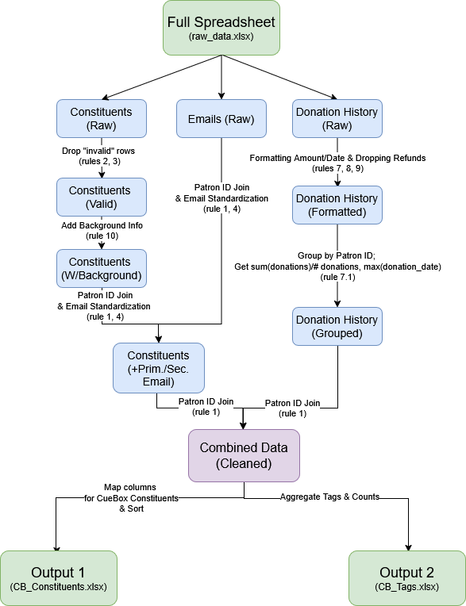

## Setup
To be able to run this on your local machine, start by running the following in your terminal after cloning the repository:
```
pip install -r requirements.txt
```

If you would like to re-create the output sheets used for my solution to see the creation process (documented by print statements), you can also run:
```
python scripts/main.py
```
## Overview + Introduction
To start my solution to this project, I first looked at the important information about the data sheet given, and the information is noted here for easy reference:

"Information about the Constituents input sheet:
* This sheet has one row per constituent.

"Information about the Emails input sheet:
* This sheet has one row per constituent per email. So if a constituent has 2 emails, then that will be 2 rows in the Emails sheet.
* If a constituent has a Primary Email in the Constituent sheet, then that email is guaranteed to be in the Emails input sheet as well, along with any additional emails that the constituent has."

"Information about the Donation History input sheet:
* This sheet has one row per donation that has ever been made."

Constituents are defined as the people and companies who attend events and make donations. The client cares a lot about this data because they use it to for marketing and fundraising outreach.

Next, I looked at the desired output:
* Produce two output spreadsheets that can be presented to the client for sign-off and then imported into CueBox. The client cares a lot about this data because they use it to for marketing and fundraising outreach.

Looking at this, there seems to be no defined output as a goal; only a repeated phrase: **The client cares a lot about this data because they use it to for marketing and fundraising outreach**.

However, I am also given 2 output sheets with the following columns:
* CueBox Constituents: CB Constituent ID, CB Constituent Type
, CB First Name , CB Last Name , CB Company Name , CB Created At , CB Email 1 (Standardized) , CB Email 2 (Standardized) , CB Title , CB Tags , CB Background Information , CB Lifetime Donation Amount , CB Most Recent Donation Date ,CB Most Recent Donation Amount
* CueBox Tags: CB Tag Name, CB Tag Count

From these 2 key pieces of information, I made the following assumptions
1. The method of outreach will primarily be by email
2. The constituents' donation amount is an important factor when choosing who to do prioritize when doing outreach.
3. The constituents' donation

## Data Cleaning
From manually looking at the data sheets, I found the primary key across the 3 input sheets to be **Patron ID**.
As an extra note, I **assumed that the different types of campaigns were seperate events** for the sake of simplicity.

I then started following the requirements listed in each of the output sheets ("Output Format: CueBox Constituents", "Output Format: CueBox Tags"). Based on this, as well as observations from looking at the data, I made these requirements and assumptions about the data.

1. Constituent/Patron ID is a unique identifier; can be used for joins.
2. If the type field does not contain a person's name or company name, the corresponding row is invalid
    1. First/last name is required for "Person" types, while company name is required for "Company" types
    2. **Assuming that names should be kept uniform using convention of capitalized first letters for first/last names**
    3. **Assuming that if the first name is missing, so is the last name (and vice versa)**
3. If the "Created At" timestamp is empty, the corresponding row is invalid. (Found in: "Constituents")
    1. **Assuming that the timestamp should be uniform in the Month DD, YYYY format**
4. Email 1 and 2 are vaguely mentioned as having to be "standardized and well-formatted for a valid domain". (Found in "Constituents"/"Email")
    1. **Assuming that the "email-validator" library suffices to check that an email is "valid"**.
    2. **Assuming Email 1 refers to the primary email from the "Constituents" sheet or the email from the "Emails" sheet in the absence of a valid primary email**
    3. **Assuming Email 2 refers to an email from the "Emails" sheet in the presence of a different, valid primary email from the "Constituents" sheet**
5. Title & Salutation can be empty (Found in: "Constituents")
6. Tags are passed through a given API to standardize: https://6719768f7fc4c5ff8f4d84f1.mockapi.io/api/v1/tags
    1. **Assuming that tag names without a mapped name should be kept as-is**
7. Format standard for currency is "$x.xx"; formatted as a string (for empty-string case) (Found in "Donation History" sheet)
    1. **Assumes the "Lifetime Donation" is total donations/number of donations**
    2. **Assuming that a donation should be dropped for "Refunded" listings since there was no income**
8. **Assuming Month DD, YYYY format for most recent donation date** (Found in "Donation History" sheet)
9. **Assuming that currency should follow the same format as lifetime donation** (Found in "Donation History" sheet)
10. Combine Job Title & Marital Status to create background info (add semicolon to divide if both exist)
    1. **Assuming "Mrs. and Mr." means "Married"**

For CueBox Tags: **Assuming tag number is formatted as int**

## Output sheet creation
The file format follows the following pipeline (made in draw.io):


"Rules" in the diagram refer to the rules defined in the "data cleaning" section. 

The process essentially takes the 3 input sheets and combines them in a way that all the needed data for both outputs is on one sheet, fully cleaned and combined. 

## Conclusion & Questions
I used various google searches to double-check my syntax, but most of my knowledge was given by my coursework. The project was made with extensive documentation in mind, while keeping in mind the speed needed for a project submitted on a rolling basis. Due to this, the documentation may look slightly messy, but it is hopefully structured enough for base-line readability.

Rule 10 was added a bit later, which is why it doesn't seem to fit the flow of the ruleset as much.

One thing I did not account for in this project is the possibility that some of the fields I assumed were drop-down/multiple choice were manually typed; in which case, things like tags would break in its functionality. Another thing I started to notice when making this project was naming convention starting to break as more features get added. I would like to know what the best practices for the company are for this scenario!

I would also like to know: in a real-job scenario, how fast do they want me to create these analytics, and how "in-depth" do they expect me to be? Though it is a vague question, I would like to know as much as possible about the data science timeline in the context of a fast-growing startup!
Finally, I would like to know more about how you approach designing the data pipeline, as well as the visuals themselves, when presenting to potential stakeholders!